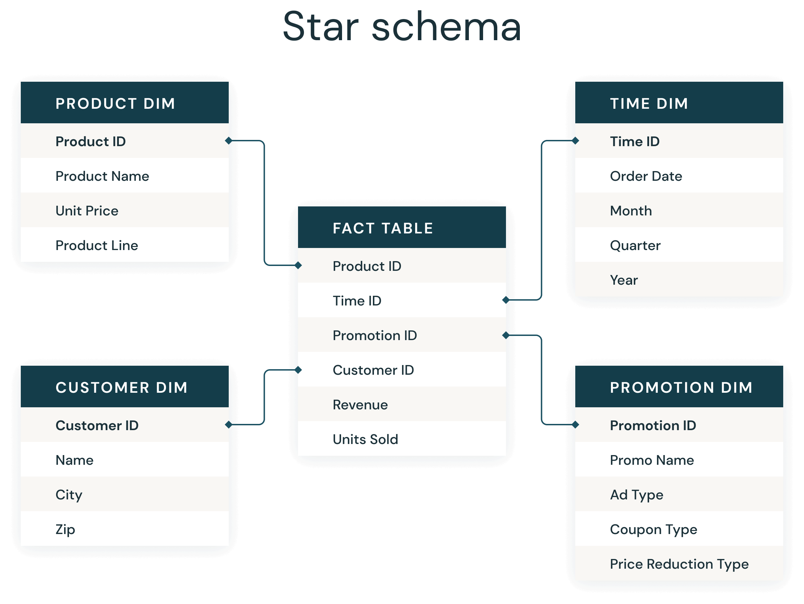
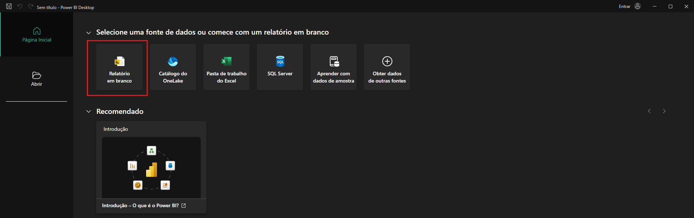
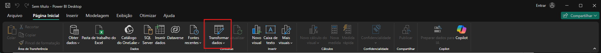
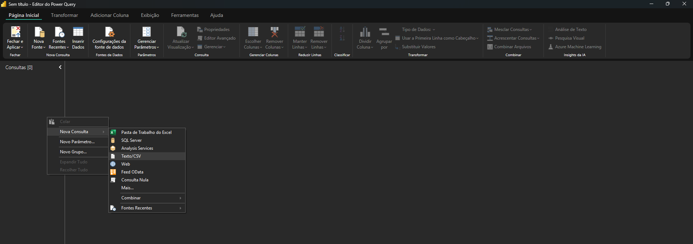
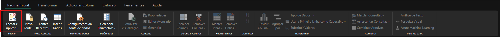
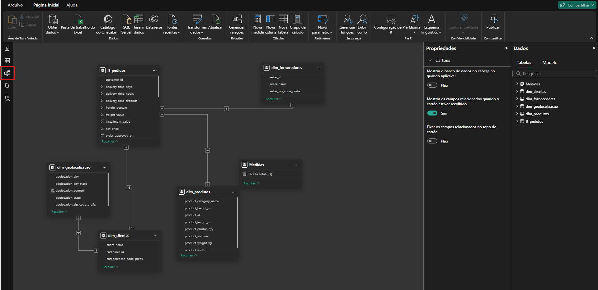

# oficina-semana-informatica

Essa oficina foi montada com a intenção de apresentar os princípios básicos de Análise, Ciência e Engenharia de dados. Com esse conteúdo é possível entender alguns conceitos de modelagem, a escrita de um código e possíveis tratamentos que podem ser aplicados no dado bruto, além da montagem de um dashboard no Power BI.

## Dataset dos Dados:

Os dados utilizados em toda a oficina foram extraídos a partir de um dataset público cadastrado no Kaggle. No entanto, fizemos algumas mudanças em alguns arquivos para tornar a oficina mais dinâmica e conseguir extrair um potencial maior das ferramentas utilizadas.

- Para o download do banco de dados original, é possível acessar o link: [https://www.kaggle.com/datasets/olistbr/brazilian-ecommerce](https://www.kaggle.com/datasets/olistbr/brazilian-ecommerce).
- Para o download dos dados modificados, é possível acessar os arquivos na pasta `/content`.

## Estágio Inicial: Preparação dos dados

Para conseguir fazer um dashboard performático, é crucial o corte de colunas e linhas "inúteis" para a aplicação final, além de manter as informações bem estruturadas e com tipagem adequada.

Para fazer nosso dashboard, optamos em estruturar os dados seguindo o modelo [Star Schema](https://www.databricks.com/glossary/star-schema), onde separamos o dado em dois tipos de tabela: fato e dimensão.

### Diferenciando uma tabela fato de uma tabela dimensão

O modelo que é implementado desde a década de 1990 assume esses dois tipos de tabela para ter uma informação com as informações "base" e outra com todas as demais informações úteis.

- Dimensão: Modelo de tabela responsável por armazenar as informações básicas das aplicações. No contexto de e-commerce, por exemplo, seria uma tabela com as informações dos produtos, clientes, fornecedores, métodos de pagamento, etc. São dados que não são modificados com tanta recorrência.
- Fato: Tabela com todas as informações de todas as atualizações que são feitas dentro do negócio. Por exemplo, uma tabela de transações, pedidos, movimentações de estoque, etc.

fonte: Databricks

Para essa oficina, foram criadas cinco tabelas: dim_clientes, dim_fornecedores, dim_geolocalizacao, dim_produtos e ft_pedidos.

Assim, cada dimensão possui as informações relevantes para o BI final, que serão conectadas na tabela fato, com todos os pedidos, a partir do identificador único de cada tabela.

### Tratamento dos Dados

Os dados são tratados com pyspark, que é uma ótima opção pois possui uma sintáxe simples e é ótimo para lidar com um grande volume de operações, pois é uma ferramenta que conta com a paralelização das suas tarefas e possui a contrução de um plano de execução, para otimizar a execução do código escrito pelo desenvolvedor.

Nessa oficina utilizaremos a plataforma Google Colab para realizar os tratamentos necessários. Para facilitar a criação dos notebooks, é possível acessar um modelo pré-pronto e documentado no diretório `assets/notebook_base.ipynb`.

## Criação do Dashboard

Para a criação do dashboard, é necessário apenas o download do Power BI e os arquivos `.csv`.

### Passo-a-passo Para Iniciar a Criação dos Gráficos

- Abrir o Power BI;
- Selecionar opção de criar relatório em branco;
  
- Selecionar opção de Transformar Dados;
  
- Clicar com o botão direito do mouse na aba de `Consultas` e ir na opção `Nova Consulta`. Em seguida, selecionar a opção `Texto/CSV` e por fim selecionar o arquivo que você deseja importar;
  
- Fechar e aplicar as alterações;
  
- Verificar os relacionamentos e as cardinalidades entre as tabelas;
  

# Autores

- [Jean Lucas Hoffelder](https://www.instagram.com/jeanlucashoffelder?utm_source=ig_web_button_share_sheet&igsh=ZDNlZDc0MzIxNw==): Estudante do Curso Análise e Desenvolvimento de Sistemas no IFRS - Feliz e Desenvolvedor da Tecnologia da Informação, na Tramontina Multi S.A.;
- [Otávio João Maldaner](https://www.instagram.com/otavio.maldaner?igsh=NXk5Z3p1eDFoaXhi&utm_source=qr): Estudante do Curso Análise e Desenvolvimento de Sistemas no IFRS - Feliz e Desenvolvedor da Tecnologia da Informação, na Tramontina Multi S.A.;
